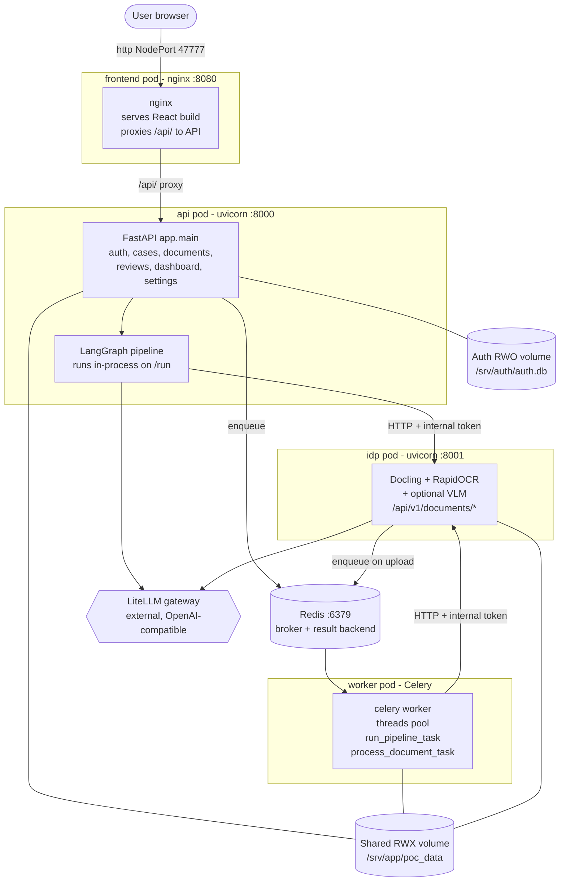
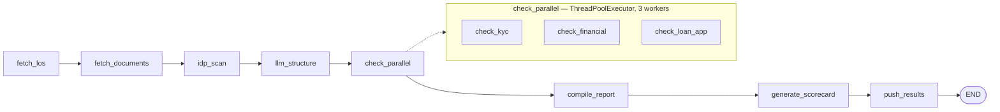
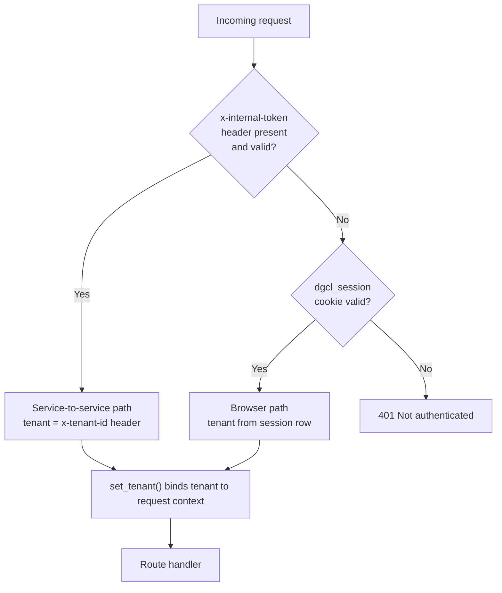
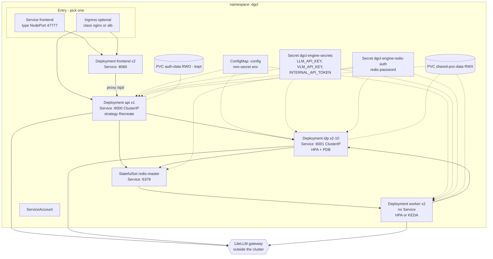

# DGCL Engine — System & Deployment Architecture

Reference for the AI-Powered Disbursement Engine as it is actually built and deployed today.
Covers the runtime components, every HTTP API, how traffic and authentication flow, the
Kubernetes deployment, and which parts can be scaled or consumed independently by other systems.

For local development setup, see [README.md](README.md). For install steps on the airgapped
cluster, see [deploy/airgap/INSTALL.md](deploy/airgap/INSTALL.md) and
[deploy/helm/README.md](deploy/helm/README.md).

---

## 1. What the system does

The platform verifies a loan disbursement package before money is released. It ingests a case's
documents (sanction letter, KFS, Aadhaar, PAN, loan agreement, bank statements, disbursal memo),
extracts text and fields from them with OCR/layout parsing, cross-checks those fields against the
Loan Origination System (LOS) record and against each other, and produces a 12-checkpoint DGCL
scorecard with an approve / review / reject recommendation.

There are two distinct execution paths, and they are independently controllable:

| Path | What runs | Entry point |
|---|---|---|
| **OCR only** | Document fetch → IDP OCR/parse → LLM field structuring | `POST /api/cases/{case_id}/run-ocr` |
| **Full DGCL verification** | All of the above → KYC/financial/loan checks → compile → scorecard → push | `POST /api/cases/{case_id}/run` |

The full DGCL path is **disabled by default** and gated behind a runtime flag
(see [§7 Feature gating](#7-feature-gating-dgcl-pipeline-kill-switch)). The OCR path always works.

---

## 2. Runtime components

Four application processes plus Redis. Three of them run from the **same backend image** with
different commands — only the entrypoint differs.



### 2.1 Component detail

| Component | Image | Command | Port | Replicas | State |
|---|---|---|---|---|---|
| **frontend** | `dgcl-engine-frontend` (nginx:1.27-alpine) | nginx | 8080 | 2 | Stateless |
| **api** | `dgcl-engine-backend` (python:3.13-slim) | `uvicorn app.main:app --workers 1` | 8000 | **1 (hard-locked)** | SQLite auth DB + in-process caches |
| **idp** | `dgcl-engine-backend` or `-gpu` | `uvicorn idp.main:app --workers 1` | 8001 | 2, HPA to 10 | Stateless per request |
| **worker** | `dgcl-engine-backend` | `celery -A pipeline.celery_app worker` | none | 2, KEDA optional | Stateless |
| **redis** | `bitnami/redis` 8.10.2 | redis-server | 6379 | 1 standalone | **Not persisted** |

Key points:

- **api, idp and worker are the same image.** `docker/Dockerfile.backend` exposes both 8000 and 8001;
  the Helm chart picks which process runs via `command`/`args`. Model weights (~700MB Docling) are
  baked into the image at build time by `scripts/download_models.py` into `/opt/models/docling`, so
  the cluster never reaches Hugging Face at runtime (`HF_HUB_OFFLINE=1`, `TRANSFORMERS_OFFLINE=1`).
- **The GPU image is only for idp.** `docker/Dockerfile.backend-gpu` (CUDA 12.4 base) is used only
  when `idp.gpu.enabled=true`; api and worker gain nothing from a GPU.
- **Celery uses a threads pool, not prefork.** Set in code at `pipeline/celery_app.py`
  (`worker_pool="threads"`), so it applies regardless of CLI flags.
- **Redis has persistence off by default.** A restart loses queued/in-flight tasks. Deliberate for
  POC scale; revisit before this queue must survive a restart.

---

## 3. The pipeline

### 3.1 Graph structure

Defined in `pipeline/graph.py` as a LangGraph `StateGraph`, strictly linear apart from one
parallel fan-out:



| Node | Responsibility |
|---|---|
| `fetch_los` | Load LOS application record for the case |
| `fetch_documents` | Stage the document package into the raw storage tier |
| `idp_scan` | Call the IDP service per document (OCR/layout), cache results into the extracted tier |
| `llm_structure` | Normalise OCR text into structured fields via the LLM gateway |
| `check_parallel` | Run KYC, financial and loan-application checkers concurrently |
| `compile_report` | Aggregate field-level results and subnode rollups |
| `generate_scorecard` | Score the 12 DGCL checkpoints, decide approve/review/reject |
| `push_results` | Write `scorecard.json`, `audit_log.json`, `status.json`; push to LOS received tier |

### 3.2 Three ways the pipeline is invoked

| Mode | Call | Where it executes | Notes |
|---|---|---|---|
| **Synchronous** | `POST /api/cases/{id}/run` | Inside the **api pod**, blocking the HTTP request | Can run for minutes; needs long proxy timeouts |
| **Streaming (SSE)** | `GET /api/cases/{id}/stream` | Inside the **api pod**, yields per-node events | Requires proxy buffering **off** |
| **Asynchronous** | `POST /api/cases/{id}/run?async=true` | Enqueued to Redis → executed in the **worker pod** | Returns a `task_id` immediately |
| **OCR only** | `POST /api/cases/{id}/run-ocr` | Inside the **api pod** | Calls `fetch_documents → idp_scan → llm_structure` directly, bypassing the graph |

This is why the api pod is sized like a compute worker (2 CPU / 2Gi limit), not like a thin API —
`/run` and `/run-ocr` do the full LLM and IDP work inside the request.

### 3.3 Document upload path

Uploading a document is the one flow that starts at the IDP service rather than the API:

```
Browser → nginx /api/ → API :8000 → IDP :8001 POST /api/v1/documents/upload
                                       ├─ writes raw file to shared volume
                                       ├─ registers in document_registry
                                       └─ enqueues process_document_task → Redis
                                                                            ↓
                                                              worker → IDP POST /process
                                                                     → writes extracted tier
```

---

## 4. API reference

Two OpenAPI surfaces. Swagger UI is at `/docs` on each (`/redoc` for ReDoc).

### 4.1 Core API — `app/main.py`, port 8000

All routes below require an authenticated tenant except `/health` and `/api/auth/*`. Auth is applied
at router-include level in `app/main.py` via `Depends(require_tenant)`.

#### Auth — `/api/auth`
| Method | Path | Purpose |
|---|---|---|
| POST | `/api/auth/signup` | Create account; provisions an isolated tenant workspace |
| POST | `/api/auth/login` | Authenticate, sets `dgcl_session` cookie |
| POST | `/api/auth/logout` | Invalidate session |
| GET | `/api/auth/me` | Current user, else 401 |

#### Cases — `/api/cases`
| Method | Path | Purpose |
|---|---|---|
| GET | `/api/cases` | List with search, filter, pagination |
| GET | `/api/cases/recent` | Recent cases |
| GET | `/api/cases/next-id` | Next auto-assigned case ID |
| GET | `/api/cases/loan-types` | Distinct loan types |
| POST | `/api/cases/create` | Create a case |
| GET | `/api/cases/{case_id}` | Case detail incl. 12 checkpoints |
| DELETE | `/api/cases/{case_id}` | Delete case and all its documents |
| POST | `/api/cases/{case_id}/run` | **Full DGCL pipeline** (flag-gated; `?async=true` for Celery) |
| POST | `/api/cases/{case_id}/run-ocr` | **OCR + structuring only** (never gated) |
| GET | `/api/cases/{case_id}/stream` | SSE live pipeline progress |
| GET | `/api/cases/{case_id}/status` | Current node, history, errors |

#### Loans (legacy surface) — `/api/loans`
| Method | Path | Purpose |
|---|---|---|
| GET | `/api/loans` | List loan IDs |
| POST | `/api/loans/{loan_id}/run` | Full pipeline, synchronous (flag-gated) |
| GET | `/api/loans/{loan_id}/status` | Execution status |
| GET | `/api/loans/{loan_id}/results` | Comparison results and rollups |
| GET | `/api/loans/{loan_id}/scorecard` | Scorecard JSON |

#### Documents — `/api/documents`
| Method | Path | Purpose |
|---|---|---|
| GET | `/api/documents` | List documents |
| GET | `/api/documents/types` | Distinct document types |
| GET | `/api/documents/{doc_id}` | Document detail + extraction |
| GET | `/api/documents/preview/{case_id}/{doc_name}` | Stream original file |
| GET | `/api/documents/{doc_id}/page/{n}/image` | Rendered page image (bbox overlays) |

#### Human review — `/api/reviews`
| Method | Path | Purpose |
|---|---|---|
| GET | `/api/reviews` | Review queue |
| GET | `/api/reviews/{review_id}` | Single review item |
| POST | `/api/reviews/{review_id}/adjudicate` | Submit human decision |

#### Dashboard, reports, settings, health
| Method | Path | Purpose |
|---|---|---|
| GET | `/api/dashboard/kpis` | KPI tiles |
| GET | `/api/reports/summary` | Verification report summary |
| GET | `/api/audit` | Audit events across loans |
| GET | `/api/settings/dgcl-pipeline` | Read the DGCL pipeline flag |
| POST | `/api/settings/dgcl-pipeline` | Enable/disable the DGCL pipeline |
| GET | `/health`, `/api/health` | Liveness/readiness (open, no auth) |

### 4.2 IDP API — `idp/main.py`, port 8001

| Method | Path | Auth | Purpose |
|---|---|---|---|
| GET | `/health` | **Open** | Liveness/readiness |
| POST | `/api/v1/documents/process` | Tenant | **Parse a document already in storage.** Returns raw text, formatted text, extracted fields, field locations, OCR tokens |
| POST | `/api/v1/documents/upload` | Tenant | Multipart upload → store → enqueue background processing |
| GET | `/api/v1/documents/{document_id}` | Tenant | Retrieve `ParsedDocument` JSON |

`POST /process` is the pure OCR primitive — it is the endpoint other systems would consume
(see [§9](#9-what-can-be-scaled-and-consumed-independently)).

---

## 5. Authentication and multi-tenancy

Two authentication mechanisms feed the **same** `require_tenant` dependency (`app/auth.py`):



1. **Browser sessions.** `dgcl_session` cookie → SQLite `sessions` table → `tenant_id`. Passwords are
   scrypt-hashed; failed logins are throttled (8 attempts / 5 min per client+username). Session TTL
   from `SESSION_TTL_HOURS`. `SESSION_COOKIE_SECURE` must be `false` on plain-HTTP NodePort, or the
   browser silently drops the cookie and login appears to do nothing.
2. **Internal service token.** `x-internal-token` (compared against `INTERNAL_API_TOKEN` with
   `hmac.compare_digest`) plus `x-tenant-id`. This is how the Celery worker and the pipeline call the
   IDP service. It is also the mechanism any **external** service would use.

**Tenancy model.** Every signup creates its own tenant (`t_<16 hex>`); all of that tenant's data lives
under `poc_data/tenants/<tenant_id>/`. The tenant is held in a `contextvar`, never taken from
client-supplied input on the browser path, and every path-building helper (`TenantPath`, `safe_join`,
`safe_id`) resolves relative to it — path traversal raises `UnsafePathError` → HTTP 400. Path
parameters `case_id` and `loan_id` are validated as safe identifiers on every authenticated request.

**There is no admin/role concept.** Every authenticated user has identical privileges, including
flipping the global DGCL pipeline flag.

---

## 6. Storage layout

| Volume | Access mode | Mount | Used by | Contents |
|---|---|---|---|---|
| `<release>-shared-poc-data` | **ReadWriteMany** | `/srv/app/poc_data` | api, worker, idp | All case/document/result data, per tenant |
| `<release>-auth-data` | **ReadWriteOnce** | `/srv/auth` | api only | `auth.db` — accounts, tenants, sessions |

The RWX volume is mandatory for correctness, not convenience: api/worker and idp are separate pods
with no shared filesystem otherwise, so a document written by one is invisible to the other. An
init container (`prepare-shared-storage`) runs on api/worker/idp and fails loudly with a clear
message if the volume is not writable by uid 10001, rather than surfacing as a 500 on first upload.

The auth DB is deliberately on its own RWO volume: SQLite needs real POSIX locking, which NFS/CephFS
do not reliably provide. The PVC carries `helm.sh/resource-policy: keep` — **`helm uninstall` does
not delete it**, because losing it loses every account. Back it up.

Per-tenant storage tiers under `poc_data/tenants/<tenant_id>/`:

```
los/            LOS records          s3_raw/                    original uploaded files
los/loans/                           s3_extracted/              per-document OCR output
los/scorecards_received/             s3_extracted_structured/   normalised fields
dms/            document source      s3_result/                 scorecard, audit, status
```

Plus one **global**, non-tenant path: `poc_data/system/pipeline_flags.json` — the DGCL kill-switch,
which applies across all tenants and must be visible to api and worker alike.

---

## 7. Feature gating: DGCL pipeline kill-switch

The full verification pipeline is off unless explicitly enabled. Enforced at **three** points, not
just in the UI, because a UI-only gate would leave the API and a queued Celery job as bypasses:

| Enforcement point | Behaviour when disabled |
|---|---|
| `POST /api/cases/{id}/run` | HTTP 403 |
| `POST /api/loans/{id}/run` | HTTP 403 |
| `run_pipeline_task` (Celery) | Re-checked at execution time; returns `{"status": "disabled"}` |

The Celery re-check matters: a task enqueued while the flag was on must still refuse to run once the
worker picks it up after the flag is turned off.

State lives in `poc_data/system/pipeline_flags.json` on the shared volume, so api and worker agree.
A missing or unreadable file means **disabled** — the fail-safe default. `POST /api/cases/{id}/run-ocr`
is never gated.

When disabled, the UI also suppresses DGCL-derived figures rather than showing stale or placeholder
numbers: the per-case 12-checkpoint scorecard, the dashboard's checkpoint-performance block and
verification-accuracy tile, and the DGCL Score columns on the cases and dashboard tables.

---

## 8. Deployment architecture

### 8.1 Kubernetes objects

Helm chart `deploy/helm/dgcl-engine` (chart 0.2.0, appVersion 1.0.0), one Bitnami Redis subchart
dependency (28.2.1).



Rendered objects: 4 Deployments, 3 Services, 2 PVCs, 1 ConfigMap, 1 ServiceAccount, 3 NetworkPolicies,
optional Ingress, optional HPAs/PDBs, optional KEDA `ScaledObject` + `TriggerAuthentication`, plus the
Redis subchart's own objects.

### 8.2 Ingress and external access

Two mutually independent entry paths — this is a common point of confusion:

**Default: NodePort, no Ingress.**
`ingress.enabled=false`, `frontend.service.type=NodePort`, `nodePort=47777`. Users hit
`http://<any-node-ip>:47777`. The frontend pod's **own nginx** (baked into the image,
`docker/nginx.frontend.conf.template`) serves the React build and reverse-proxies `/api/` to
`<release>-api:8000`. Note 47777 is **outside** Kubernetes' default nodePort range (30000–32767) —
the cluster's `--service-node-port-range` must include it.

**Optional: Ingress with TLS.**
`ingress.enabled=true` renders an Ingress routing `/api` → api:8000 and `/` → frontend:8080. It does
**not** replace the frontend's internal nginx, which still serves the UI; it adds a cluster-level
entry in front of it. When switching, set `frontend.service.type=ClusterIP` and
`config.SESSION_COOKIE_SECURE=true`.

Whichever path is used, three proxy settings are mandatory or the app breaks in non-obvious ways:

| Setting | Value | Why |
|---|---|---|
| Body size | `60m` | `MAX_DOCUMENT_SIZE_MB=50`; nginx's 1m default 413s any real upload |
| Read/send timeout | `600s` | `/run` and `/run-ocr` execute the whole pipeline inside the request (`IDP_REQUEST_TIMEOUT` is 300s **per document**); the 60s default cuts them |
| Proxy buffering | `off` | `/api/cases/{id}/stream` is server-sent events; buffering breaks live progress |

The chart applies these as `nginx.ingress.kubernetes.io/*` annotations when the Ingress is enabled,
and the frontend image's nginx applies the equivalent settings for the NodePort path.

### 8.3 Network policies

`networkPolicy.enabled=true` renders three **ingress-only** policies:

| Policy | Protects | Admits traffic from | Port |
|---|---|---|---|
| `<release>-idp` | idp pods | api, worker | 8001 |
| `<release>-redis` | redis pods | api, worker, idp | 6379 |
| `<release>-frontend-to-api` | api pods | frontend, plus any namespace (ingress controller path) | 8000 |

Consequences worth knowing:

- **The IDP service is not reachable by anything except api and worker.** Another workload in the
  cluster calling it will be dropped until you add it to the `-idp` policy.
- These are **ingress** policies only. Egress is unrestricted by this chart — outbound calls to the
  LiteLLM gateway work without extra rules. If your platform applies a cluster-wide default-deny
  **egress** policy, you must add your own allow rules; this chart does not.
- The Bitnami subchart ships its own permissive `<release>-redis` NetworkPolicy that collides by name
  with the restricted one here, so it is explicitly disabled (`redis.networkPolicy.enabled=false`).

### 8.4 Configuration and secrets

Non-secret settings come from the ConfigMap (`values.yaml` → `config:`) and are mounted as env vars
via `envFrom`. `IDP_SERVICE_URL` is **derived** from the release name
(`http://<release>-idp:8001`), not hard-coded — hard-coding it previously broke every install not
named exactly `dgcl-engine`.

Secrets are **never** in values files. Create out-of-band before install:

| Secret | Keys | Purpose |
|---|---|---|
| `dgcl-engine-secrets` | `LLM_API_KEY`, `VLM_API_KEY`, `INTERNAL_API_TOKEN` | Gateway keys; shared service-to-service token (`openssl rand -hex 32`) |
| `dgcl-engine-redis-auth` | `redis-password` | Redis AUTH, also consumed by KEDA's TriggerAuthentication |

`REDIS_URL` cannot be declared directly because Kubernetes env vars can't interpolate other env vars.
A shell wrapper (`dgcl.entrypoint` helper) assembles it at container start from
`REDIS_HOST/PORT/DB/PASSWORD`, then `exec`s the real command.

### 8.5 Security context

All backend pods run as uid/gid **10001**, non-root, with `fsGroup: 10001` so mounted volumes are
group-writable. The uid is numeric on purpose: the image's `USER appuser` is by name, which the
kubelet cannot verify under a `runAsNonRoot` policy, and the container would be refused. Plain NFS
exports ignore `fsGroup` — fix export ownership there instead.

### 8.6 Airgapped delivery

`deploy/airgap/build-bundle.sh` produces a self-contained bundle: `docker save`'d image tarballs,
the packaged Helm chart, `values-airgap.yaml`, install scripts, `MANIFEST.txt` and `SHA256SUMS`.
On the target side, `verify-bundle.sh` checks the hashes and `load-and-push-images.sh` loads and
retags images into the internal registry. Images are then addressed via `global.imageRegistry`.
The Bitnami Redis image must be pushed under the same path it is referenced by
(`<registry>/bitnami/redis:<tag>`), and `global.security.allowInsecureImages=true` is required —
Bitnami charts refuse to render once the registry no longer matches their known-good source.

---

## 9. What can be scaled and consumed independently

### 9.1 Scaling characteristics

| Component | Horizontally scalable | Mechanism | Blocker |
|---|---|---|---|
| **idp** | **Yes** | HPA on CPU, min 2 / max 10 | None — stateless per request |
| **worker** | **Yes** | Replicas, HPA, or KEDA on Redis queue depth | None |
| **frontend** | **Yes** | Replicas | None |
| **api** | **No — locked to 1** | — | SQLite auth DB (single writer) + per-process document registry and case cache |
| **redis** | No | Standalone, no persistence | Would need Sentinel/cluster mode |

The API's single-replica limit is enforced by the chart itself — it **refuses to render** with
`api.replicaCount > 1`. Two blockers must be cleared to lift it, both code changes:

1. Move accounts/sessions from SQLite to a shared database (e.g. Postgres).
2. Move the in-process document registry and case cache to shared state — this is also why the API
   runs a single uvicorn worker: with two, a document registered by one process can be missing from
   a listing served by the other.

For the worker, prefer **KEDA over CPU-based HPA**. A worker blocked on an LLM HTTP call shows low
CPU and a CPU-driven HPA would scale it *down* exactly when the Redis queue is growing. The chart
ships a KEDA `ScaledObject` (Redis list `celery`, list length 5, min 1 / max 12) — disabled by
default, enable it once KEDA is installed.

### 9.2 The IDP service as a standalone OCR API

**`POST /api/v1/documents/process` is the endpoint to expose to other teams.** It is the pure OCR
primitive: given a document already in storage, it returns raw text, formatted text, extracted
fields, field locations and OCR tokens. It holds no per-request state, needs no browser session,
scales horizontally, and is the only piece here with real reuse value outside disbursement.

To consume it from another service:

```http
POST http://<release>-idp.<namespace>.svc.cluster.local:8001/api/v1/documents/process
Content-Type: application/json
x-internal-token: <INTERNAL_API_TOKEN>
x-tenant-id: <tenant id>

{ "document_id": "DOC-123", "s3_key": "path/to/file.pdf" }
```

Four things must be changed or accounted for first — it is **not** callable as-is:

1. **NetworkPolicy.** The `<release>-idp` policy admits only api and worker pods. Add the calling
   workload's selector, or the connection is silently dropped.
2. **Service exposure.** The idp Service is ClusterIP with no NodePort and no Ingress path. In-cluster
   callers can reach it by DNS; anything outside needs a new Service type or Ingress rule.
3. **Shared volume.** `/process` reads the document from, and writes results to, the shared RWX volume
   under the tenant's path. A caller outside this deployment must either write files into that same
   volume first or use `/upload` (multipart) instead — but note `/upload` also enqueues a Celery task,
   coupling it to Redis and the worker.
4. **Tenant header.** `x-tenant-id` must be a valid existing tenant; it determines every path the
   service touches.

**Which APIs are *not* independently consumable:**

- Everything on `/api/cases`, `/api/loans`, `/api/reviews`, `/api/documents`, `/api/dashboard` —
  these read and write case state on the shared volume and assume this deployment's data layout.
- `POST /api/cases/{id}/run` — executes in the single-replica api pod and is a long-blocking call;
  it is a workflow trigger, not a service API. For programmatic use prefer `?async=true` and poll
  `/api/cases/{id}/status`.
- `/api/auth/*` — tied to this deployment's SQLite user store.

### 9.3 If the OCR engine should become a shared platform service

The current coupling to the shared filesystem is what prevents clean reuse. The changes, in order of
value:

1. Accept the document **in the request body** (or via presigned object-storage URL) and return the
   parse result inline, removing the shared-volume dependency from `/process`.
2. Give it its own Service exposure and NetworkPolicy allow-list.
3. Split it into its own Helm release — the image already supports this, since `idp/main.py` is a
   separate FastAPI app and the GPU image's default command already starts it standalone
   (`CMD ["uvicorn", "idp.main:app", "--port", "8001"]`).

Steps 1–3 need no change to the pipeline, the API, or the worker.

---

## 10. Known constraints

| Constraint | Impact | Fix |
|---|---|---|
| api locked to 1 replica | No HA for the API; brief downtime on every upgrade (`Recreate` strategy, RWO volume) | Shared DB + shared cache |
| Redis persistence off | Queued/in-flight tasks lost on Redis restart | Enable persistence with a real StorageClass |
| No admin role | Any logged-in user can flip the global DGCL pipeline flag | Add a role column and an admin dependency |
| Auth DB on RWO volume | Cannot be mounted by multiple nodes; survives `helm uninstall` by design | Back it up; migrate to Postgres to scale |
| Object storage not wired | `idp/services/storage/s3.py` falls back to a local filesystem mock | Set `AWS_*` config + secret keys |
| `SESSION_COOKIE_SECURE` must match scheme | `true` on plain HTTP silently breaks login | Keep `false` for NodePort, `true` for TLS ingress |
