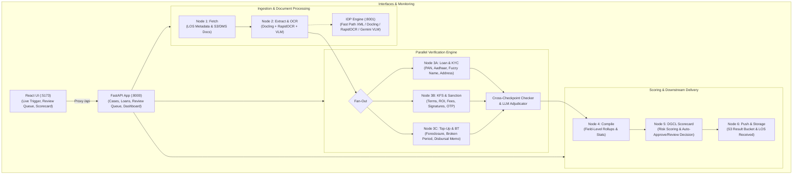

# Automated Loan Disbursement Scorecard & Verification Engine

An enterprise-grade, end-to-end AI-powered loan disbursement verification platform built with **Python**, **FastAPI**, **LangGraph**, **Docling**, **RapidOCR**, **Gemini**, and **React / TypeScript**.

The engine automates pre-disbursement compliance checks by ingesting multi-format loan document packages, performing high-accuracy OCR / layout parsing, executing multi-node business rule validations with fuzzy matching and LLM adjudication, compiling risk metrics, generating final DGCL disbursement scorecards, and exposing an interactive dashboard for operations teams.

---

## Architecture Overview



### Pipeline Workflow

1. **Node 1 (Fetch)**: Ingests LOS application metadata, DMS documents (Sanction Letter, KYC Aadhaar/PAN, Bank Statements, CIBIL, OTP audit logs) into local/S3 raw storage.
2. **Node 2 (Extract & IDP)**: Orchestrates intelligent document processing via Docling XML fast path, native Docling parser, and RapidOCR with character-level confidence scoring and Gemini VLM fallback.
3. **Node 3 (Parallel Verification)**:
   - **3A. Loan & KYC**: Zero-tolerance loan amount cross-document validation, tenure/validity checks, Jaro-Winkler name fuzzy matching, PAN exact matching, and TF-IDF cosine similarity for address proof.
   - **3B. KFS & Sanction**: Sanction letter vs Key Fact Statement (KFS) terms, ROI, processing fee validation, photo face embedding similarity, pyHanko digital signature verification, OTP consent audit trail, and mandatory Aadhaar XML verification.
   - **3C. Top-Up & Balance Transfer**: Foreclosure amount reconciliation, broken period interest calculation, disbursal memo application and closure ID tracking, and bank statement verification.
4. **Checker Node & LLM Adjudication**: Performs cross-checkpoint consistency analysis across all subnodes. Borderline matches or ambiguous discrepancies are adjudicated using Gemini LLM with deterministic rule fallback.
5. **Node 4 (Compile)**: Aggregates field-level results, counts summary statistics, and compiles subnode rollups (`Verified`, `Discrepancy`, `Indeterminate`).
6. **Node 5 (DGCL Scorecard)**: Evaluates weighted risk scores, determines approval thresholds, and outputs the final decision (`AUTO_APPROVE_ELIGIBLE`, `FLAGGED_FOR_HUMAN_REVIEW`, or `REJECT_OR_FLAG`).
7. **Node 6 (Push & Audit)**: Emits final `scorecard.json`, `audit_log.json`, `compiled_report.json`, and `status.json` to S3 result buckets and pushes scorecards to the downstream LOS queue.

---

## Directory Structure

```
├── app/                            # FastAPI Application Backend (:8000)
│   ├── main.py                     # App entrypoint, CORS, global middleware
│   ├── routers/
│   │   ├── cases.py                # Cases listing, detail, search, and live execution trigger
│   │   ├── loans.py                # Loan-level pipeline endpoints and scorecards
│   │   ├── reviews.py              # Human review queue & adjudication endpoints
│   │   ├── dashboard_reports.py    # Real-time dashboard KPIs and compliance reports
│   │   └── documents.py            # Document metadata and PDF binary streaming
│   └── serializers/
│       └── case_serializer.py      # Pipeline result mapping to frontend schemas
├── pipeline/                       # LangGraph Verification Engine
│   ├── config.py                   # Business thresholds, fuzzy weights, and storage paths
│   ├── state.py                    # PipelineState schema & subnode rollup calculators
│   ├── graph.py                    # StateGraph orchestration & conditional branching
│   ├── storage.py                  # S3/Local artifact persistence & status.json manager
│   ├── audit.py                    # Structured audit_log.json event recorder
│   └── nodes/
│       ├── node1_fetch.py          # Document fetching from LOS/DMS
│       ├── node2_extract.py        # IDP extraction & OCR loader
│       ├── node3a_loan_kyc.py      # Identity & KYC comparison engine
│       ├── node3b_kfs_sanction.py  # Terms, Sanction & KFS comparison engine
│       ├── node3c_topup_bt.py      # Top-up, BT & Foreclosure comparison engine
│       ├── node_checker.py         # Cross-node consistency checker
│       ├── llm_adjudicator.py      # Gemini LLM adjudication with fallback
│       ├── node4_compile.py        # Report compiler
│       ├── node5_scorecard.py      # DGCL scorecard & risk score generator
│       └── node6_push.py           # Result push to S3 & LOS
├── idp/                            # Intelligent Document Processing Microservice (:8001)
│   ├── main.py                     # IDP FastAPI entrypoint
│   ├── api/routes/                 # Document ingestion & processing routes
│   ├── core/                       # IDP configuration, logging, and exceptions
│   ├── models/ & schemas/          # Document, layout, OCR, and table Pydantic schemas
│   └── services/
│       ├── docling/                # Docling XML fast path and native parser
│       ├── ocr/                    # RapidOCR engine, confidence evaluator, preprocessor
│       ├── vlm/                    # Gemini VLM fallback client and router
│       ├── storage/                # S3 document connector
│       └── output/                 # JSON/XML multi-format serializer
├── frontend/                       # React / TypeScript / Vite Dashboard UI (:5173)
│   ├── src/
│   │   ├── api/                    # Node2 and API client definitions
│   │   ├── components/             # Reusable UI cards, tables, charts, drawers, viewers
│   │   ├── pages/                  # Dashboard, Cases, Verification, Review Queue, Audit, Reports
│   │   ├── services/               # API service integration with fallback to mock data
│   │   └── types/                  # TypeScript interface definitions
│   └── vite.config.ts              # Vite config with backend proxy (/api -> :8000)
├── poc_data/                       # Simulated S3 Buckets, LOS, and DMS data
│   ├── los/loans/                  # LOS loan application input payloads
│   ├── los/scorecards_received/    # Scorecards delivered to LOS
│   ├── dms/                        # DMS source PDFs and documents
│   ├── s3_raw/                     # Raw loan documents per case
│   └── s3_result/                  # Pipeline execution outputs and audit logs
├── tests/                          # Automated Pytest Suite (18 test modules, 68+ tests)
│   ├── idp/                        # IDP unit and integration tests
│   ├── test_node3a.py              # KYC comparison tests
│   ├── test_node3b.py              # KFS & Sanction comparison tests
│   ├── test_node3c.py              # Top-up & BT comparison tests
│   ├── test_checker_node.py        # Cross-checkpoint validation tests
│   ├── test_llm_adjudicator.py     # LLM adjudication & fallback tests
│   ├── test_api_cases.py           # Cases API tests
│   ├── test_api_reviews.py         # Human adjudication API tests
│   ├── test_api_security_and_reviews.py # Security & boundary condition tests
│   ├── test_pipeline_edge_cases.py # Extreme thresholds & corrupt data tests
│   └── test_integration.py         # End-to-end multi-loan pipeline tests
├── generate_mock_data.py           # Synthetic loan case data generator
├── config.py                       # Global configuration and environment settings
├── requirements.txt                # Python backend dependencies
└── pytest.ini                      # Pytest runner configuration
```

---

## Quickstart Guide

### 1. Prerequisites & Installation

Ensure you have **Python 3.10+** and **Node.js 18+** installed.

```bash
# Clone the repository
git clone <repo-url>
cd "Automated Disbursment Scorecard"

# Install Python dependencies
pip install -r requirements.txt

# Install Frontend dependencies
cd frontend
npm install
cd ..
```

### 2. Environment Configuration

Create a `.env` file in the root directory (or use default environment fallbacks):

```env
GEMINI_API_KEY=your_gemini_api_key_here
GEMINI_MODEL=gemini-2.5-flash
APP_PORT=8000
IDP_PORT=8001
ENVIRONMENT=development
```

### 3. Generate Mock Test Data

Generate synthetic loan applications, documents, and S3 fixtures:

```bash
python generate_mock_data.py
```

### 4. Running the Services

#### Option A: Run Backend API Server
```bash
uvicorn app.main:app --reload --port 8000
```
* **Swagger API Docs**: `http://127.0.0.1:8000/docs`
* **Health Check**: `http://127.0.0.1:8000/health`

#### Option B: Run IDP Microservice (Optional standalone)
```bash
uvicorn idp.main:app --reload --port 8001
```

#### Option C: Run Frontend Application
```bash
cd frontend
npm.cmd run dev
```
* **Frontend Web App**: `http://localhost:5173`

---

## API Reference

### Cases & Verification Engine
| Method | Endpoint | Description |
| :--- | :--- | :--- |
| `GET` | `/api/cases` | List all cases with search, risk level filtering, and pagination |
| `GET` | `/api/cases/{case_id}` | Retrieve comprehensive case details, documents, and scorecard |
| `POST` | `/api/cases/{case_id}/run` | Trigger the LangGraph verification pipeline for a specific case |
| `GET` | `/api/cases/{case_id}/status` | Retrieve real-time incremental execution progress |
| `GET` | `/api/cases/loan-types` | Get distinct loan types for filtering |

### Human Review & Adjudication Queue
| Method | Endpoint | Description |
| :--- | :--- | :--- |
| `GET` | `/api/reviews` | List flagged checkpoints awaiting human review |
| `GET` | `/api/reviews/{review_id}` | Retrieve individual review item context and discrepancies |
| `POST` | `/api/reviews/{review_id}/adjudicate` | Submit human override/approval decision with audit remarks |

### Dashboard & Analytics
| Method | Endpoint | Description |
| :--- | :--- | :--- |
| `GET` | `/api/dashboard/kpis` | Real-time operational metrics (STP Rate, TAT, Discrepancy Rate) |
| `GET` | `/api/reports/summary` | Aggregate verification compliance summary across all subnodes |

### Documents & Streaming
| Method | Endpoint | Description |
| :--- | :--- | :--- |
| `GET` | `/api/documents` | List indexed case documents and extraction status |
| `GET` | `/api/documents/{doc_id}` | Get document metadata and extracted bounding box data |
| `GET` | `/api/documents/preview/{case_id}/{doc_name}` | Stream binary PDF content for in-browser inspection |

---

## Test Scenarios

The test dataset covers standard, edge, and failure disbursement conditions:

- **`LOAN_001` (Clean Match / Happy Path)**:
  - Loan amount, KYC PAN, Aadhaar, KFS, and Sanction match with 100% precision.
  - Subnode Rollups: `Verified` / `Verified` / `Verified`.
  - Final Decision: `AUTO_APPROVE_ELIGIBLE`.
- **`LOAN_002` (Critical Discrepancies)**:
  - Loan amount mismatch between Sanction and LOS, missing mandatory Aadhaar XML, failed OTP consent.
  - Subnode Rollups: `Discrepancy` / `Discrepancy`.
  - Final Decision: `REJECT_OR_FLAG`.
- **`LOAN_003` (Fuzzy Match & LLM Adjudication)**:
  - Applicant name variation ("Mohd Rizwan" vs "Mohammad Rizwan") triggers Jaro-Winkler partial band (0.75 – 0.92).
  - Routes to Gemini LLM adjudicator with structured audit trail recording in `audit_log.json`.
- **`LOAN_ERR` & Edge Cases**:
  - Validates missing documents, corrupt PDFs, zero thresholds, and network fallback behavior.

---

## Running Automated Tests

The repository enforces strict testing standards with 100% deterministic test isolation.

```bash
# Run all unit, integration, and API tests
pytest -v

# Run only pipeline verification tests
pytest tests/test_node3a.py tests/test_node3b.py tests/test_node3c.py -v

# Run IDP microservice tests
pytest tests/idp/ -v

# Run API contract & security tests
pytest tests/test_api_cases.py tests/test_api_security_and_reviews.py -v
```

---

## Quality & Compliance Standards

- **Zero Hardcoded Business Logic**: All comparison thresholds, fuzzy score tolerances, and storage paths are configured in [`pipeline/config.py`](file:///d:/Projects/Automated%20Disbursment%20Scorecard/pipeline/config.py) and [`config.py`](file:///d:/Projects/Automated%20Disbursment%20Scorecard/config.py).
- **Structured Audit Logging**: Every subnode execution, rule evaluation, and LLM adjudication writes immutable records to `audit_log.json`.
- **Resilient Fallbacks**: Real-time fallback handlers ensure continuous operation even if external OCR engines or LLM APIs encounter rate limits or latency.
